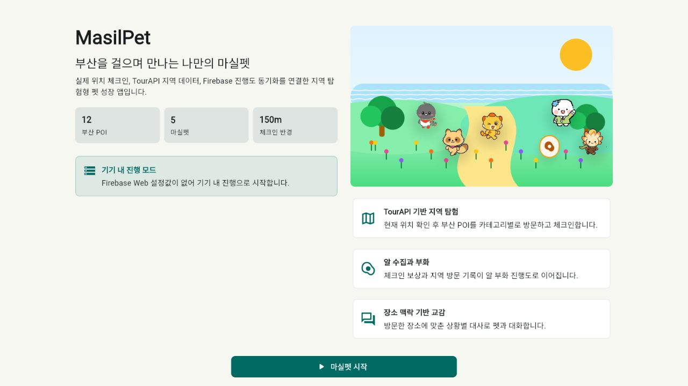
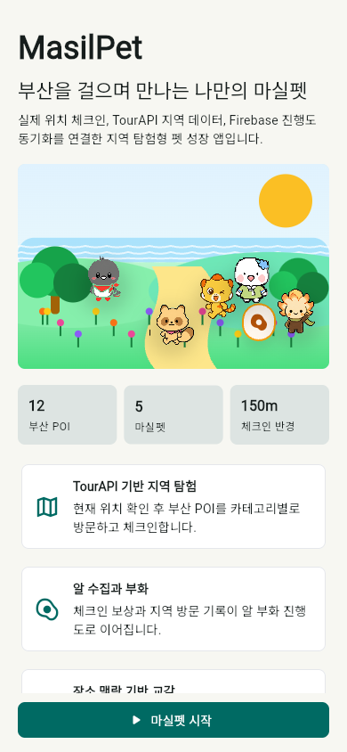

# MasilPet

MasilPet은 사용자가 대한민국 전역을 걸으며 체크인하고, 지역 맥락을 가진 마실펫을 수집·성장시키는 위치 기반 펫 성장 앱입니다. Flutter Web, Firebase Auth/Firestore/Functions, TourAPI 연동 구조를 기준으로 전국 POI 탐험과 7종 수집 루프를 제공합니다.

## 미리보기

<p>
  
  
</p>

## 핵심 기능

- 실제 위치 기반 150m 체크인 판정
- 최근 15분 안에 현재 위치를 확인한 경우에만 체크인을 여는 위치 검증 흐름
- 하루 20회 서버 체크인 상한과 같은 POI 당일 중복 체크인 방지
- OpenStreetMap 타일 기반 전국 POI 지도와 카테고리 마커
- 지도 화면에서 목표별 장소를 좁히는 POI 카테고리 필터
- TourAPI/Firebase Functions를 통한 주변 장소 조회 구조
- Firebase 익명 인증과 Firestore 사용자 진행도 동기화
- Firebase가 없거나 일시적으로 실패해도 이어서 플레이할 수 있는 기기 내 진행 저장
- Firebase Web 설정 누락 또는 초기화 실패 시 원인을 앱 화면에 표시하는 연결 진단
- 내 정보 화면에서 앱 버전, 빌드 채널, UTC 빌드 시각을 확인하는 릴리스 진단
- Flutter 첫 프레임 전 로딩 화면과 JavaScript 비활성화 대체 안내
- 체크인 보상, 알 부화, 펫 성장·진화 조건
- 위치 확인, 첫 체크인, 펫 교감, 알 부화를 이어 주는 오늘의 산책 루트
- 도감 목표와 새 카테고리를 반영한 상위 3개 추천 코스
- 내 정보 화면에서 확인하는 최근 방문 기록과 체크인 보상 이력
- 내 정보 화면에서 복사할 수 있는 오늘의 탐험 리포트
- 내 정보 화면에서 위치 확인·체크인·교감·연속 탐험·부화 준비를 보여주는 탐험 배지
- 마실펫 탭의 동행 대화 카드에서 보여주는 지역 방문 맥락 대사와 교감 액션
- 오늘의 하우스 플랜, 전국 탐험 여권, 도감, 탐험 준비 상태를 보여주는 진행률 화면
- PWA 메타데이터, 앱 아이콘, 설치 바로가기, Firebase Hosting 캐시 정책

## 실행

```powershell
flutter pub get
flutter test
flutter run -d chrome
```

릴리즈 웹 빌드:

```powershell
flutter build web --release
```

Firebase Web 설정값은 빌드/실행 시 `--dart-define`으로 주입합니다.

```powershell
flutter run -d chrome `
  --dart-define=FIREBASE_WEB_API_KEY=... `
  --dart-define=FIREBASE_WEB_APP_ID=... `
  --dart-define=FIREBASE_MESSAGING_SENDER_ID=...
```

배포용 preflight는 같은 값을 환경 변수에서 읽어 릴리즈 빌드에 주입합니다.

```powershell
$env:FIREBASE_WEB_API_KEY="..."
$env:FIREBASE_WEB_APP_ID="..."
$env:FIREBASE_MESSAGING_SENDER_ID="..."
```

`tools/release_preflight.ps1`는 `pubspec.yaml`의 버전, 빌드 채널, UTC 빌드 시각을 `MASILPET_APP_VERSION`, `MASILPET_BUILD_CHANNEL`, `MASILPET_BUILD_TIME_UTC`로 함께 주입합니다. 빌드 채널을 바꾸려면 실행 전에 `$env:MASILPET_BUILD_CHANNEL="contest"`처럼 설정합니다.
지도 타일은 기본적으로 OpenStreetMap 공개 타일을 사용합니다. 제출 후 트래픽 규모나 심사 환경에 맞춰 별도 타일 서비스 또는 프록시를 사용해야 하면 `$env:MASILPET_MAP_TILE_URL_TEMPLATE="https://tiles.example.com/{z}/{x}/{y}.png"`와 `$env:MASILPET_MAP_TILE_USER_AGENT="com.masilpet.app"`를 설정한 뒤 preflight를 실행합니다.

## Firebase 배포

TourAPI 키는 Firebase Secret으로 등록합니다.

```powershell
firebase login
firebase functions:secrets:set TOUR_API_KEY
$env:FIREBASE_WEB_API_KEY="..."
$env:FIREBASE_WEB_APP_ID="..."
$env:FIREBASE_MESSAGING_SENDER_ID="..."
powershell -ExecutionPolicy Bypass -File tools/release_preflight.ps1
firebase deploy --only functions,firestore,hosting
```

전국 기본 지역, POI, 펫 템플릿, 대사 시드는 운영자 custom claim(`operator: true`)이 있는 계정으로만 callable Functions에서 반영할 수 있습니다. 일반 익명 사용자는 공용 데이터 쓰기와 TourAPI 동기화를 실행할 수 없습니다.

```powershell
$env:GOOGLE_APPLICATION_CREDENTIALS="C:\secure\masilpet-service-account.json"
powershell -ExecutionPolicy Bypass -File tools/set_operator_claim.ps1 -Uid "OPERATOR_UID"
powershell -ExecutionPolicy Bypass -File tools/run_operator_callable.ps1 -Uid "OPERATOR_UID" -FunctionName seedStarterRegionData
```

`pubspec.lock`은 릴리즈 빌드 재현성을 위해 저장소에 포함합니다.

## 보안과 개인정보

- 사용자는 Firebase 익명 인증으로 시작하며 이름, 이메일, 소셜 계정을 요구하지 않습니다.
- Firestore rules는 사용자가 본인의 진행도만 읽도록 제한하고, 펫·알·체크인·성장 기록 쓰기는 Cloud Functions(Admin SDK)로만 처리합니다.
- 현재 위치는 주변 POI 조회와 150m 체크인 검증에 사용됩니다. 앱은 최근 15분 안에 확인한 위치에서만 체크인을 열며, 체크인 성공 시 검증 좌표, 거리, 장소, 보상 기록이 사용자 진행도에 저장될 수 있습니다.
- 사용자는 `내 정보` 화면에서 진행도 초기화를 실행해 기기 내 진행과 온라인 진행도를 초기화할 수 있습니다.
- TourAPI 키는 Firebase Secret으로 관리하며 Flutter Web 빌드 산출물에 포함하지 않습니다.
- 배포된 개인정보 처리방침은 `/privacy.html`에서 확인할 수 있으며, 원문은 [docs/PRIVACY_POLICY.md](docs/PRIVACY_POLICY.md)에 보관합니다.

## 구조

```text
lib/
  main.dart
  src/
    app.dart
    models.dart
    seed_data.dart
    services.dart
    state.dart
    screens/
    widgets/
functions/
  src/index.ts
assets/
  pets/
test/
```

## 검증

현재 기준 검증 명령:

```powershell
powershell -ExecutionPolicy Bypass -File tools/release_preflight.ps1 -SkipFirebase
powershell -ExecutionPolicy Bypass -File tools/local_judging_smoke.ps1
powershell -ExecutionPolicy Bypass -File tools/release_evidence.ps1 -AllowDirtyWorktree -AllowDraftEvidence
```

출품 전 확인 절차는 [릴리즈 체크리스트](docs/RELEASE_CHECKLIST.md), [운영 런북](docs/OPERATIONS_RUNBOOK.md), [개인정보 처리방침](docs/PRIVACY_POLICY.md), [제출 패키지](docs/SUBMISSION_PACKAGE.md)에 정리되어 있습니다.

## 캐릭터 에셋 규칙

마실펫 에셋은 `assets/pets/{petKey}` 아래에 최종 PNG만 번들합니다.

```text
assets/
  pets/
    {petKey}/
      emotions/{emotion}.png
      growth/{stage}.png
      actions/{action}.png
      animations/{action}_{frame}.png
```

경로 문자열은 화면에서 직접 만들지 않고 [PetAssets](lib/src/pet_assets.dart)에서 생성합니다.
