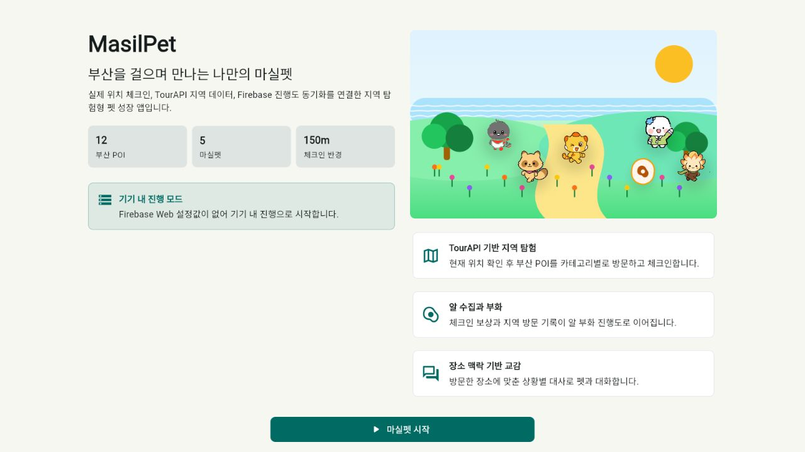
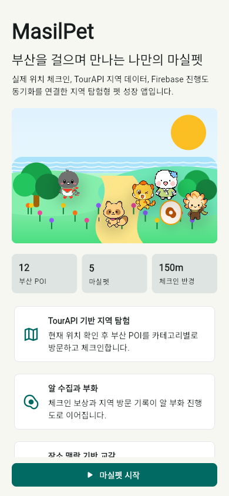

# MasilPet

MasilPet은 사용자가 대한민국 전역을 걸으며 체크인하고, 지역 맥락을 가진 마실펫을 수집·성장시키는 위치 기반 펫 성장 앱입니다. Flutter Web·Android·iOS, Firebase Auth/Firestore/Functions, TourAPI 연동 구조를 기준으로 전국 POI 탐험과 37종 수집 루프를 제공합니다.

## 미리보기

<p>
  
  
</p>

> 위 미리보기 이미지는 종이 수첩 아트 디렉션 재개편 이전에 촬영한 것으로, 실기기 브라우저에서
> 다시 촬영해 교체해야 합니다. PWA 설치 미리보기도 같은 파일을 사용합니다.

## 핵심 기능

- 실제 위치 기반 150m 체크인 판정
- 최근 15분 안에 현재 위치를 확인한 경우에만 체크인을 여는 위치 검증 흐름
- 하루 20회 서버 체크인 상한과 같은 POI 당일 중복 체크인 방지
- OpenStreetMap 타일 기반 전국 POI 지도와 카테고리 마커
- 지도를 움직인 뒤 현재 위치로 되돌리는 `지금 여기` 지도 컨트롤
- 지도 화면을 당겨 현재 위치를 다시 확인하는 새로고침
- 지도 화면에서 목표별 장소를 좁히는 POI 카테고리 필터
- 도감·하우스 목표에서 지도 카테고리 필터로 이어지는 지도 목표 카테고리
- TourAPI/Firebase Functions를 통한 주변 장소 조회 구조
- Firebase 익명 인증과 Firestore 사용자 진행도 동기화
- Firebase가 없거나 일시적으로 실패해도 이어서 플레이할 수 있는 기기 내 진행 저장
- Firebase Web 설정 누락 또는 초기화 실패 시 원인을 앱 화면에 표시하는 연결 진단
- 기록 화면에서 앱 버전, 빌드 채널, UTC 빌드 시각을 확인하는 릴리스 진단
- Flutter 첫 프레임 전 로딩 화면과 JavaScript 비활성화 대체 안내
- 체크인 보상, 알 부화, 펫 성장·진화 조건
- 위치 확인, 첫 체크인, 펫 교감, 알 부화를 이어 주는 오늘의 산책 루트
- 체크인 직후 화면에 찍히는 방문 인증 도장과 지도의 방문 인증 완료 카드
- 도감 목표와 새 카테고리를 반영한 오늘의 산책 코스
- 기록 화면에서 확인하는 최근 산책 타임라인과 체크인 보상 이력
- 최근 5회 너머의 산책을 모아 보는 전체 기록 시트
- 지난달 도장을 넘겨 보는 산책 여권 월 이동
- 기록 화면에서 복사할 수 있는 오늘의 리포트
- 오늘의 리포트에 함께 표시되는 등급, 점수, 성장 루프, 카테고리 진척
- 지도·하우스·마실펫·도감·기록 탭의 진행 상태를 보여주는 텍스트 탭 배지
- 열려 있는 탭을 다시 눌러 그 페이지 맨 위로 돌아가기
- 발견한 마실펫을 이름·지역·분류로 찾는 도감 검색과 지역별 수집률
- 이전 버튼, 진행 점, 시스템 뒤로가기로 되짚을 수 있는 3단계 온보딩
- 체크인 도장, 알 부화, 펫 교감, 탭 전환에 실리는 햅틱 피드백
- 시스템 `동작 줄이기`를 따르는 반복 애니메이션과 큰 글씨 설정에서도 잘리지 않는 레이아웃
- 기록 화면에서 위치 확인·체크인·교감·연속 산책·부화 준비를 보여주는 수첩 목표
- 마실펫 탭의 동행 대화 카드에서 보여주는 지역 방문 맥락 대사와 교감 액션
- 37종 캐릭터별 말투와 시간·상태·돌봄·친밀도·진화·방문 상황에 대응하는 대화 카탈로그
- 마당에서 펫·공·밥그릇을 만지고, 알 진행도와 오늘의 돌봄을 함께 보는 하우스
- PWA 메타데이터, 앱 아이콘, 설치 바로가기, Firebase Hosting 캐시 정책

## 실행

```powershell
flutter pub get
flutter test
flutter run -d chrome
```

릴리즈 웹 빌드:

```powershell
flutter build web --release
```

Firebase Web 설정값은 빌드/실행 시 `--dart-define`으로 주입합니다.

```powershell
flutter run -d chrome `
  --dart-define=FIREBASE_WEB_API_KEY=... `
  --dart-define=FIREBASE_WEB_APP_ID=... `
  --dart-define=FIREBASE_MESSAGING_SENDER_ID=...
```

### Android 앱

Android 패키지 ID는 `com.masilpet.app`입니다. Firebase 설정값이 없을 때도 기기 내 진행 모드로 실행되며, 온라인 동기화를 사용하려면 Android 앱을 Firebase 프로젝트에 같은 패키지 ID로 등록한 뒤 설정값을 주입합니다.

```powershell
flutter run -d <android-device-id> `
  --dart-define=FIREBASE_ANDROID_API_KEY=... `
  --dart-define=FIREBASE_ANDROID_APP_ID=... `
  --dart-define=FIREBASE_MESSAGING_SENDER_ID=...
```

Play Store용 App Bundle:

```powershell
flutter build appbundle --release `
  --dart-define=FIREBASE_ANDROID_API_KEY=... `
  --dart-define=FIREBASE_ANDROID_APP_ID=... `
  --dart-define=FIREBASE_MESSAGING_SENDER_ID=...
```

실제 배포 전에는 `android/key.properties`에 별도 업로드 키를 연결하고, Play Console에서 앱 서명을 설정해야 합니다.

### iOS 앱

iOS Bundle ID도 `com.masilpet.app`이며 Firebase Apple SDK 요구사항에 맞춰 iOS 15 이상을 지원합니다. Firebase iOS 앱 등록 후 macOS와 Xcode에서 다음과 같이 실행합니다.

```bash
flutter run -d <ios-device-id> \
  --dart-define=FIREBASE_IOS_API_KEY=... \
  --dart-define=FIREBASE_IOS_APP_ID=... \
  --dart-define=FIREBASE_MESSAGING_SENDER_ID=...
```

App Store용 IPA:

```bash
flutter build ipa --release \
  --dart-define=FIREBASE_IOS_API_KEY=... \
  --dart-define=FIREBASE_IOS_APP_ID=... \
  --dart-define=FIREBASE_MESSAGING_SENDER_ID=...
```

최종 IPA 생성에는 Apple Developer Team, 배포 인증서, 프로비저닝 프로파일이 필요합니다.

배포용 preflight는 같은 값을 환경 변수에서 읽어 릴리즈 빌드에 주입합니다.

```powershell
$env:FIREBASE_WEB_API_KEY="..."
$env:FIREBASE_WEB_APP_ID="..."
$env:FIREBASE_MESSAGING_SENDER_ID="..."
```

`tools/release_preflight.ps1`는 `pubspec.yaml`의 버전, 빌드 채널, UTC 빌드 시각을 `MASILPET_APP_VERSION`, `MASILPET_BUILD_CHANNEL`, `MASILPET_BUILD_TIME_UTC`로 함께 주입합니다. 빌드 채널을 바꾸려면 실행 전에 `$env:MASILPET_BUILD_CHANNEL="contest"`처럼 설정합니다.
지도 타일은 기본적으로 OpenStreetMap 공개 타일을 사용합니다. 제출 후 트래픽 규모나 심사 환경에 맞춰 별도 타일 서비스 또는 프록시를 사용해야 하면 `$env:MASILPET_MAP_TILE_URL_TEMPLATE="https://tiles.example.com/{z}/{x}/{y}.png"`와 `$env:MASILPET_MAP_TILE_USER_AGENT="com.masilpet.app"`를 설정한 뒤 preflight를 실행합니다.

## 백엔드 및 Firebase 배포

현재 온라인 백엔드는 Firebase Functions 대신 Cloudflare Worker
`masilpet-api`를 사용합니다. Worker는 `functions/src/index.ts`의 공통 로직을
재사용하며, TourAPI 키와 Firebase 서비스 계정은 Cloudflare Worker Secret으로
관리합니다.

백엔드 수동 배포:

```powershell
npm --prefix functions ci
npm --prefix cloudflare-worker ci
npm --prefix functions run build
npm --prefix cloudflare-worker run check
npm --prefix cloudflare-worker run dry-run
npm --prefix cloudflare-worker run deploy
```

필수 환경변수, 최초 Secret 등록, 로컬 실행, 배포 검증과 롤백 방법은
[Cloudflare Worker 운영 문서](cloudflare-worker/README.md)를 참고합니다.

Firebase Hosting과 Firestore 설정은 별도로 배포합니다.

```powershell
flutter build web --release
firebase login
firebase deploy `
  --project masilpet-8ef37 `
  --only hosting,firestore:rules,firestore:indexes
```

현재 GitHub Actions는 검사만 수행하므로 `main`에 커밋하거나 병합해도
Cloudflare Worker와 Firebase Hosting은 자동 배포되지 않습니다.

`pubspec.lock`은 릴리즈 빌드 재현성을 위해 저장소에 포함합니다.

## 보안과 개인정보

- 사용자는 Firebase 익명 인증으로 시작하며 이름, 이메일, 소셜 계정을 요구하지 않습니다.
- Firestore rules는 사용자가 본인의 진행도만 읽도록 제한하고, 펫·알·체크인·성장 기록 쓰기는 인증된 Cloudflare Worker(Admin SDK)에서 처리합니다.
- 현재 위치는 주변 POI 조회와 150m 체크인 검증에 사용됩니다. 앱은 최근 15분 안에 확인한 위치에서만 체크인을 열며, 체크인 성공 시 검증 좌표, 거리, 장소, 보상 기록이 사용자 진행도에 저장될 수 있습니다.
- 사용자는 `기록` 화면의 `진행도 관리`에서 진행도 초기화를 실행해 기기 내 진행과 온라인 진행도를 초기화할 수 있습니다.
- TourAPI 키는 Cloudflare Worker Secret으로 관리하며 Flutter Web 빌드 산출물에 포함하지 않습니다.
- 배포된 개인정보 처리방침은 `/privacy.html`에서 확인할 수 있으며, 원문은 [docs/PRIVACY_POLICY.md](docs/PRIVACY_POLICY.md)에 보관합니다.

## 디자인 시스템

전체 화면은 **종이 수첩(paper notebook)** 아트 디렉션을 따릅니다. 파치먼트 지면 위에 카드 스톡을
올리고, 방문 인증은 붉은 고무도장으로 찍고, 구분선은 모두 점선으로 그립니다.

| 축 | 값 |
| --- | --- |
| 지면 / 카드 / 시트 | `#F2E9D8` / `#FBF6EA` / `#F7F1E2` |
| 먹색 / 본문 / 흐린 글씨 | `#23201B` / `#6E6355` / `#9A8A72` |
| 도장 빨강 / 숲 초록 | `#B23A2E` / `#2E5C46` |
| 모서리 | 2~4px (거의 직각), 필 버튼만 999px |
| 그림자 | 흐림 0의 오프셋 그림자 (`5px 5px 0`, `0 3px 0`) |
| 타이포 | Gowun Batang(제목·버튼) · Gowun Dodum(본문) · Nanum Pen Script(여백 메모) · IBM Plex Mono(날짜·카운터) |

- 토큰은 `lib/src/theme.dart` 한 곳에만 둡니다(`MasilPetPalette`, `MasilPetType`,
  `MasilPetRadii`, `MasilPetShadows`, `MasilPetMotion`).
- 공용 조각은 `lib/src/widgets/paper_kit.dart`(카드·도장·점선·손글씨·필터 필·통계 바),
  화면 프레임은 `lib/src/widgets/paper_shell.dart`(머리글·텍스트 탭·사이드 레일)에 있습니다.
- 폰트는 OFL 라이선스 TTF를 `assets/fonts/`에 번들합니다(라이선스 원문 동봉). 네트워크
  없이도 같은 화면이 나옵니다.

## 구조

```text
lib/
  main.dart
  src/
    app.dart
    dialogue_data.dart
    models.dart
    seed_data.dart
    services.dart
    state.dart
    theme.dart          # 종이 수첩 디자인 토큰
    screens/
    widgets/
      paper_kit.dart    # 공용 종이 UI 조각
      paper_shell.dart  # 머리글 + 탭/레일 프레임
functions/
  src/index.ts
assets/
  fonts/
  pets/
test/
```

## 검증

현재 기준 검증 명령:

```powershell
powershell -ExecutionPolicy Bypass -File tools/release_preflight.ps1 -SkipFirebase
powershell -ExecutionPolicy Bypass -File tools/local_judging_smoke.ps1
powershell -ExecutionPolicy Bypass -File tools/release_evidence.ps1 -AllowDirtyWorktree -AllowDraftEvidence
```

출품 전 확인 절차는 [릴리즈 체크리스트](docs/RELEASE_CHECKLIST.md), [운영 런북](docs/OPERATIONS_RUNBOOK.md), [개인정보 처리방침](docs/PRIVACY_POLICY.md), [제출 패키지](docs/SUBMISSION_PACKAGE.md)에 정리되어 있습니다. 캐릭터 이름과 말투, 대사 추가 규칙은 [캐릭터·대사 가이드](docs/CHARACTER_DIALOGUE_GUIDE.md)를 따릅니다.

## 캐릭터 에셋 규칙

마실펫 에셋은 `assets/pets/{petKey}` 아래에 최종 PNG만 번들합니다.

```text
assets/
  pets/
    {petKey}/
      emotions/{emotion}.png
      growth/{stage}.png
      actions/{action}.png
      animations/{action}_{frame}.png
```

경로 문자열은 화면에서 직접 만들지 않고 [PetAssets](lib/src/pet_assets.dart)에서 생성합니다.
